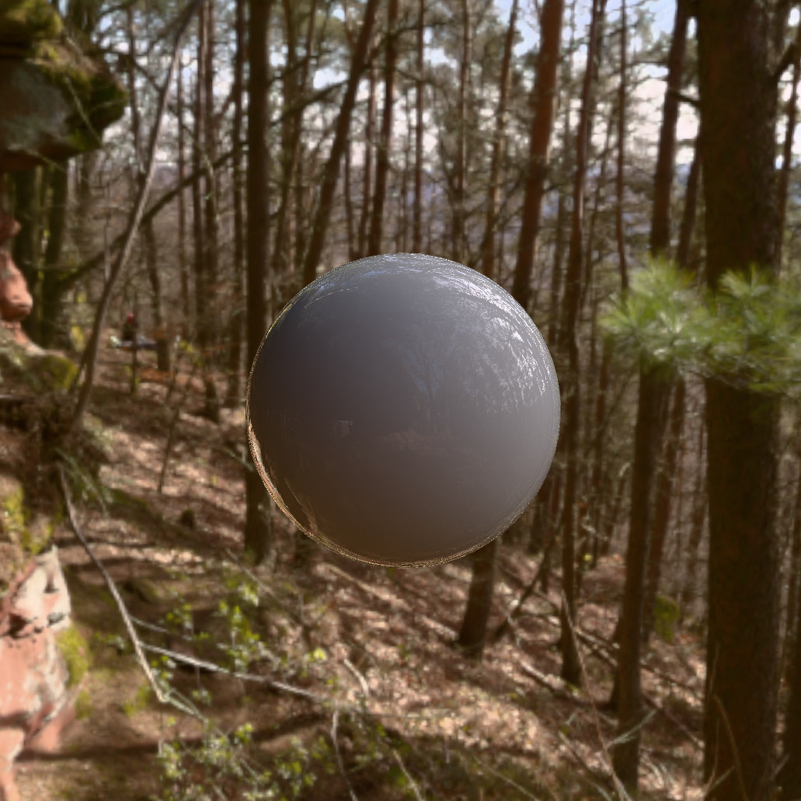
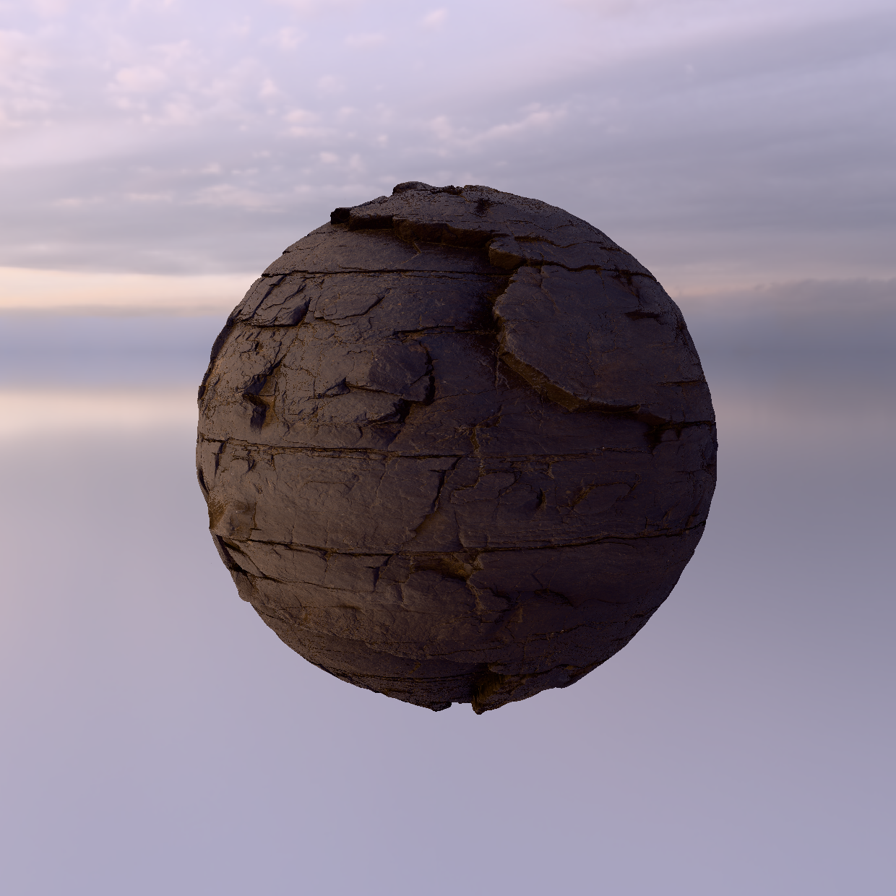
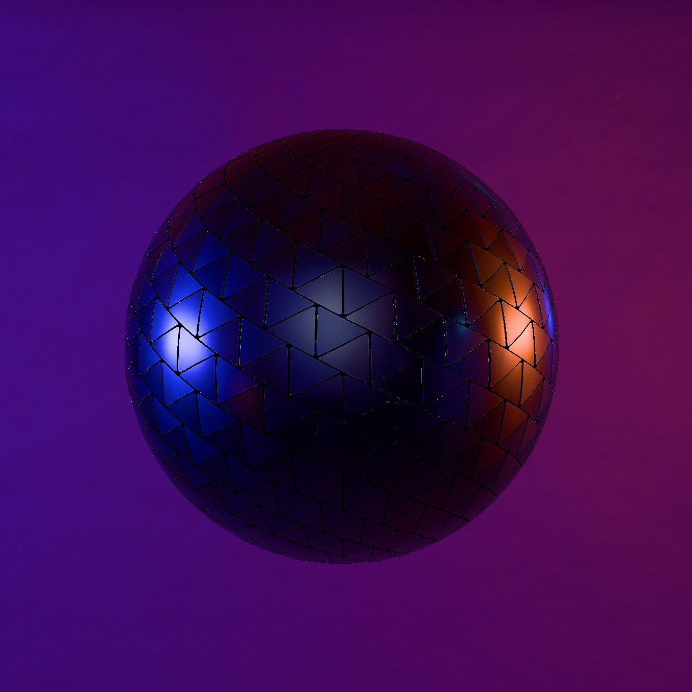
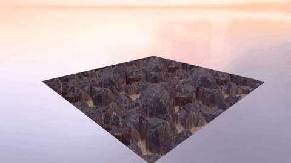

# MaterialViewer

MaterialViewer is a program for viewing PBR materials in different scenarios.
\
\
Its purpose is very similar to the RenderCore library it is based on, meaning it is a learning project to teach me about graphics programming.

</img> </img> </img>
</img> &nbsp;</img>
*Real-time rendering of a few different materials*

## Features

The viewer supports materials in form of split PNG images as albedo, normal, roughness, metallic, displacement and ambient occlusion maps as well as a separate window with settings like:
- Several models and skyboxes
- Several tonemapping curves
- Several displacement methods like Parallax Occlusion Mapping and Normal-Based Curved Silhouettes

## Usage

To apply a material to the model, simply drag and drop one or multiple PNG files onto the viewer window and select the matching map type.
\
\
The camera can be zoomed in/out by scrolling and rotated around the model by dragging the mouse wheel.

## Important Notes

When first starting the viewer it will have to bake some textures. This might take a while but is only performed on first startup as the resulting files are cached.
\
If there was an error or crash during the baking process the cached files might get corrupted. In that case simply delete the cached files inside your build folder under __MaterialViewer/cache__.
\
\
Also note that there are some settings/techniques that do not work together and will either look broken or will simply not use the incompatible technique. These are mainly:
- __Cubespheres__ and displacement by __Normal-Based Curved Silhouettes__
- Displacement by __Vertex Offset__ and self occlusion by __Height Field Visibility__

## Requirements

**To build**
- Windows 10/11 SDK
- CMake 3.20+
- C++20 capable compiler (MSVC / Visual Studio 2019 or newer)

**To run**
- Windows 10/11 (x64)
- A Direct3D 11.0 capable GPU (2 GB+ VRAM recommended)

## Build Process

To build the application, open __x64 Native Tools Command Prompt for VS__ or a different x64 developer shell, navigate to the top level directory and build using the x64-release (or x64-debug) preset:
```
cmake --preset x64-release
cmake --build --preset x64-release
```
